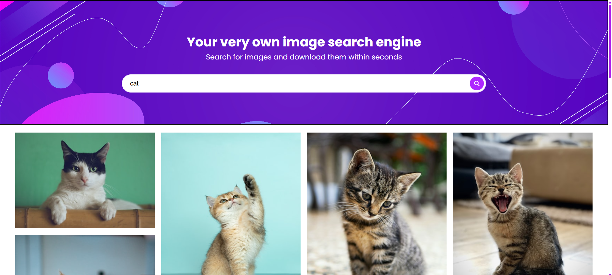
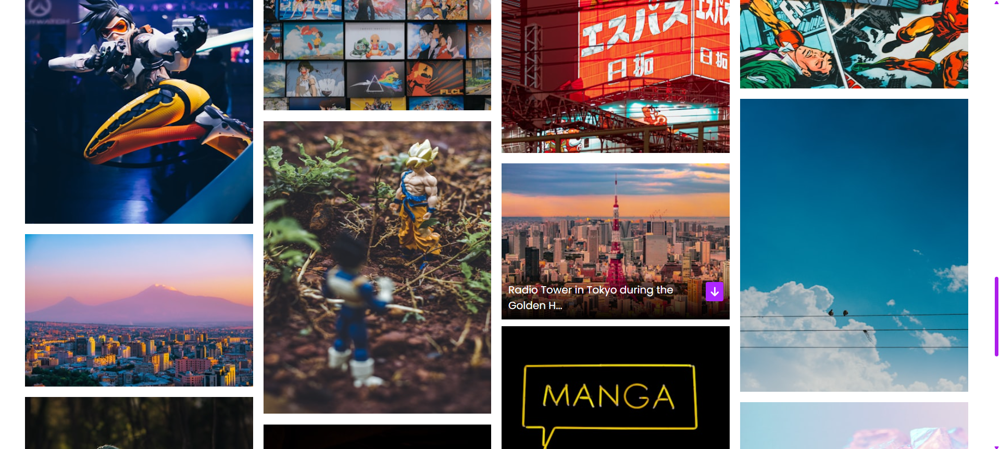

# 📌 Project Title: *[Image search]*

## 🛠️ Tech Stack Used
- **Frontend**: HTML, CSS, Scss JavaScript
- **API used**: [unsplash API](https://unsplash.com/developers)

## 📚 Concepts Learned
- download content in the form of BLOB content type
- API integration
- Asynchronous programming using `async/await`

## 🖼️ Screenshots / Images

*Home Page*

*API Response Output*

*On image hover*

*User can load more when the MORE button is clicked*

