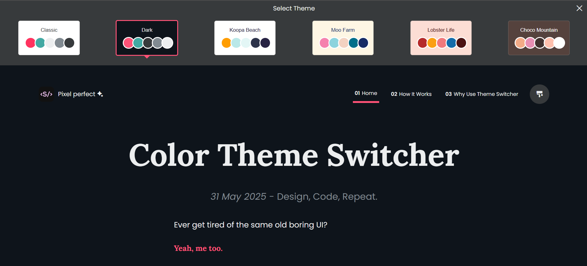
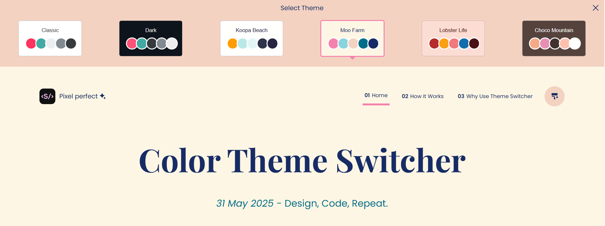
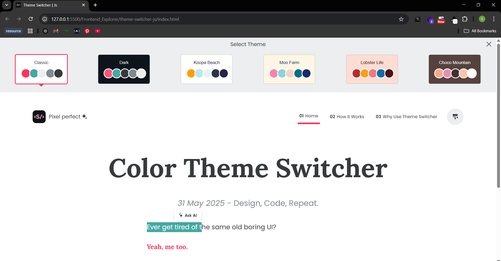
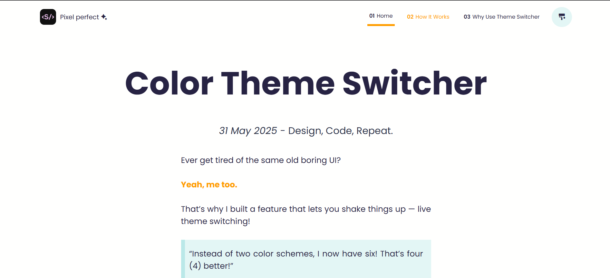

# 📌 Project Title: *Multi theme switcher*

## 📄 Info

| Item                 | Details                                        |
|----------------------|------------------------------------------------|
| **Tech Stack Used**  | Html, scss, Vanilla js                         |
| **Learnt**           | using Vanilla Js learnt dom manipulation, learnt to add a favico, css pseudoselectors like ::befor, ::after, practiced scss and localstorage, made use of remix icon |
| **Improvements**     | Plan to learn animation and some advanced js in the next project |
| **Inspiration from**     | [color-theme-switcher](https://mxb.dev/blog/color-theme-switcher/) |

## 🖼️ Screenshots / Images

*Description: [Dark theme]*

*Description: Different themes available, color switch and font-family switch*

*Description: Favicon and Logo*

*Description: classic theme*

*Description: Tabs switch*